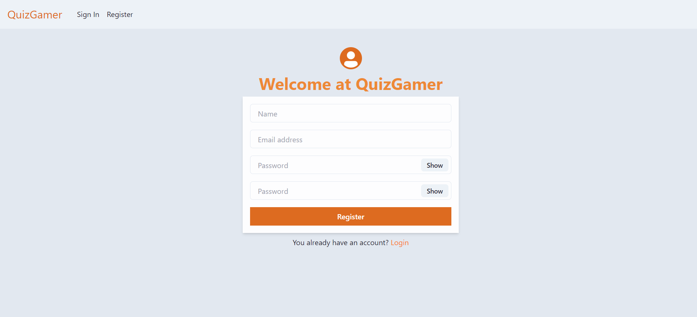
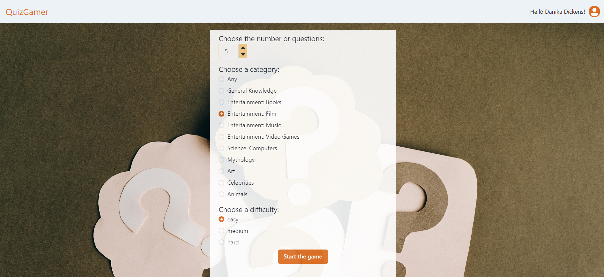
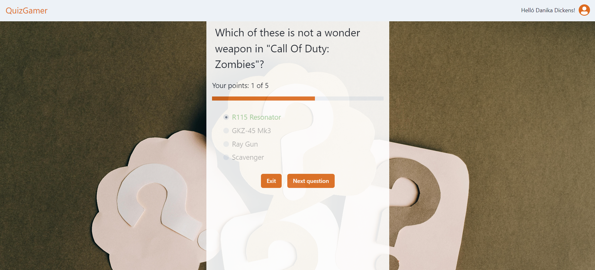
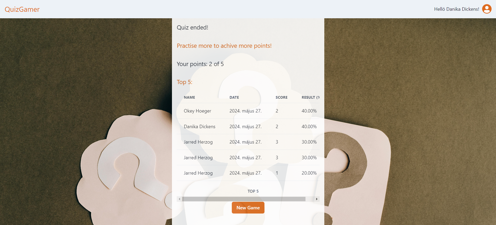

# Frontend for the Quiz









## Used:
- React.js
- Chakra.UI
- Trivia API

## Set up
Start the backend at localhost:8000

```
php artisan serve
```

Start the frontend at localhost:5173

```
npm run dev
```